## My Pytorch Toolkit
Userful pytorch toolkit for training models, replacing boilerplate code.
Provides functions for training, modeling and evaluating models.
Also provides several architecture implementations.

## Installation
### From PyPI

```bash
pip install my-pytorch-kit
```

### From source
Clone this repo and run `pip install .`.  
Then, you can import the module `my_pytorch_kit`.

## Usage

This package revolves around the [`BaseModel`](my_pytorch_kit/model/models.py), [`Trainer`](my_pytorch_kit/train/train.py) and [`Evaluator`](my_pytorch_kit/evaluation/evaluation.py) classes, which are extended to model, train and evaluate a model respectively.  


<p align="middle">
  
</p>


Furthermore, this package provides architecture implementations and modelling utilities.
Currently implemented architectures include:
- [Classifier](docs/models/classifier.md)
- [Autoencoder](docs/models/ae.md)
- [Variational Autoencoder, Semi-supervised VAE](docs/models/vae.md)

Lastly the [`Tuner`](my_pytorch_kit/train/tune.py) class provides hyperparameter tuning using grid, random and random dynamic search.

For an **initial** guide, see the [`examples/mnist/classifier/example.py`](examples/mnist/classifier/example.py) file.


## Development
Clone this repo and run `pip install -e .[dev]`.  
Run pytest in the root directory to run tests.  

