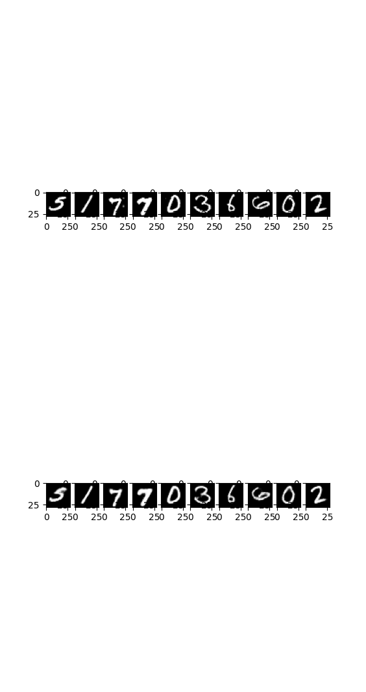
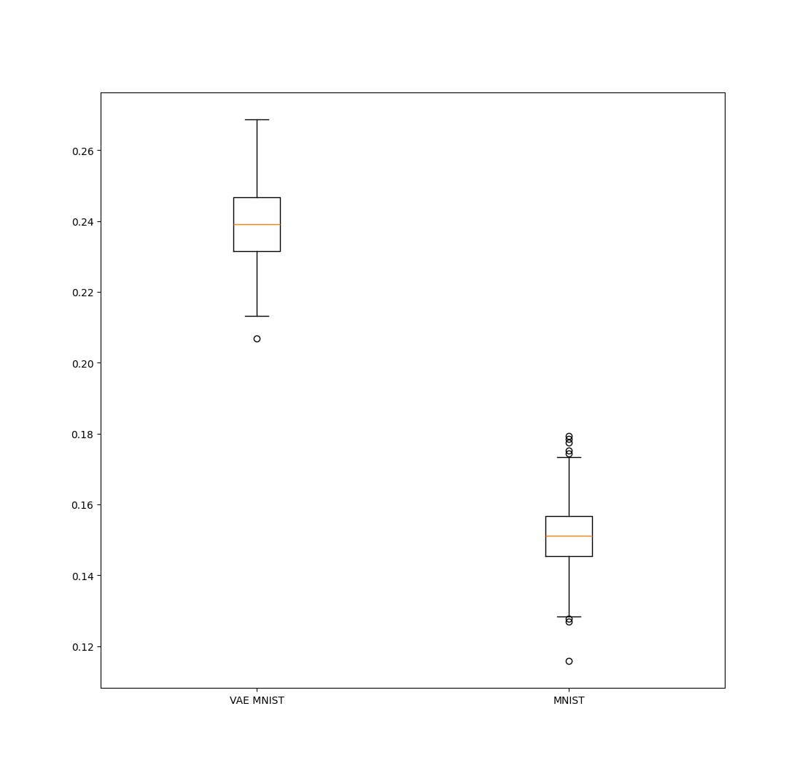

# Autoencoder

## Architecture
The convolutional **Encoder** returns a representation in the latent space, which is then used by the convolutional **Decoder** to reconstruct the input image.

## Usage
The `ImageAE` class is implemented in the [`my_pytorch_kit.model.ae`](../../my_pytorch_kit/model/ae) module.
Import using:
```python
from my_pytorch_kit.models.ae import ImageAE
```
Their application on the MNIST dataset can be found in the [`examples/mnist/autoencoder/ae.py`](../../examples/mnist/autoencoder/ae.py) module.
Enter the `examples` directory and run `python -m mnist.autoencoder.ae`.

## Results on MNIST

The `ImageAE` class has been configured with three convolutional layers.
For details on the exact model, you can load the model from `exaples/models/ae.pt`.

Below, we can examine the reconstruction on the test set when setting the latent space dimension to 4.

<p align="middle">
    
</p>

This model can also now be used for out-of-distribution detection, as seen below with images generated by VAEs.

<p align="middle">
  
</p>
