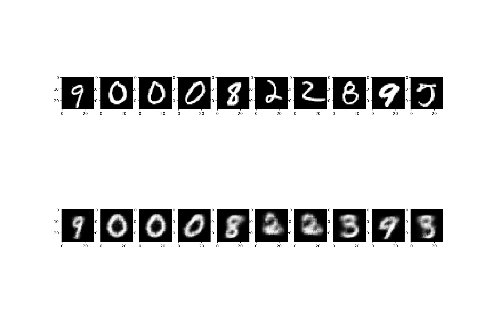
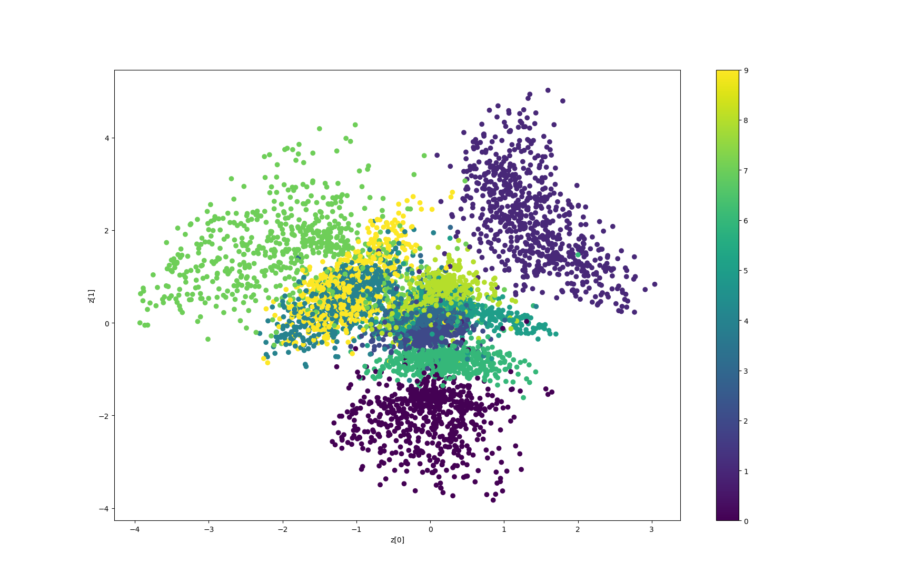

# Variational Autoencoder

## Architectures
The convolutional **Encoder** does not return a representation in the latent space, instead a mean and log variance of a gaussian distribution in the latent space is returned.
Following this, the **Sampler** returns a sample from a gaussian distribution in the latent space.
The convolutional **Decoder** returns a reconstruction of the input image, using the sampled latent space representation.
Reconstruction loss and KL divergence loss are used to train the reconstruction, whilst the distrubutions returned by the encoder are penalized to converge towards the standard gaussian distribution.

After a sucessfull training, one can then generate new images by drawing from the standard normal distribution on the latent space and passing it through the decoder.

#### With Semi-Supervision
A seperate classifier is trained besides the Decoder to predict the image labels given the latent space distribution.
This penealizes overlapping latent space representations of the encoder, allowing for more distinct image generation.
Furthermore, image generation can now be paired with a corresponding label.

## Usage

The `ImageVAE` class and the `ImageVAESemiSupervised` class are both implemented in the `my_pytorch_kit.models.vae` module.
Import using:
```python
from my_pytorch_kit.models.vae import ImageVAE, ImageVAESemiSupervised
```
Their application on the MNIST dataset can be found in the `examples/mnist/generator/vae.py` module.
Enter the `examples` directory and run `python -m mnist.generator.vae`.

## Results on MNIST

The `ImageVAE` class has been configured with three convolutional layers.
For details on the exact model, you can load the model from `exaples/models/vae_model_1.pt`.
Below are plots on the reconstruction (test set), label clusters (test set) and image generated from the latent space repectively.

<p align="middle">
  
   
  
</p>

One can observe in the second picture, that the representation of the labels in the latent space are overlapping.
This also leads to the generation of a mixed category of images.


To overcome this, the `ImageVAESemiSupervised` class has been trained.
For details on the exact model, you can load the model from `exaples/models/vae_semi_3.pt`.

<p align="middle">
  
   
  
</p>

We can now see that the representation of the labels in the latent space are distinct, the generation of images as well, picking up on more detailed features per category.

Finally, we have generated images from this model, as seen in `exaples/mnist/generator/vae_semi_generate.py`.


<p align="middle">
  
</p>
